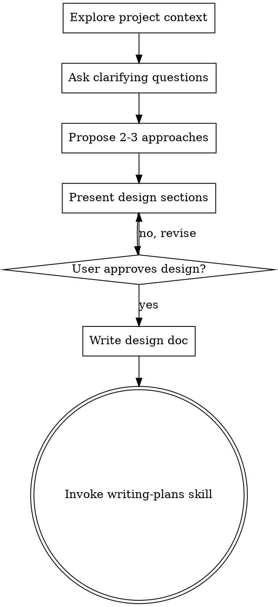

# Brainstorming Ideas Into Designs

## Overview

Help turn ideas into fully formed designs and specs through natural collaborative dialogue.

Start by understanding the current project context, then ask questions one at a time to refine
the idea. Once you understand what you're building, present the design and get user approval.

<HARD-GATE>
Do NOT invoke any implementation skill, write any code, scaffold any project, or take any
implementation action until you have presented a design and the user has approved it.
This applies to EVERY project regardless of perceived simplicity.
</HARD-GATE>

## Checklist

Complete in order:

1. **Explore project context** — check files, docs, recent commits
2. **Ask clarifying questions** — one at a time, understand purpose/constraints/success criteria
3. **Propose 2-3 approaches** — with trade-offs and your recommendation
4. **Present design** — in sections scaled to their complexity, get user approval after each section
5. **Write design doc** — save to `docs/plans/YYYY-MM-DD-<topic>-design.md` and commit
6. **Transition to implementation** — invoke writing-plans skill to create implementation plan

## Process Flow

The only skill invoked after brainstorming is **writing-plans**. Do NOT invoke frontend-design,
mcp-builder, or any other implementation skill.

## The Process

**Understanding the idea:**
- Check the current project state first (files, docs, recent commits)
- Ask questions one at a time to refine the idea
- Prefer multiple choice questions when possible; open-ended is fine too
- Only one question per message — break complex topics into multiple messages
- Focus on: purpose, constraints, success criteria

**Exploring approaches:**
- Propose 2-3 different approaches with trade-offs
- Lead with your recommended option and explain why

**Presenting the design:**
- Once you understand what you're building, present the design
- Scale each section to its complexity: a few sentences if straightforward, up to 200–300 words if nuanced
- Ask after each section whether it looks right
- Cover: architecture, components, data flow, error handling, testing
- YAGNI ruthlessly — remove unnecessary features from all designs

## After the Design

1. Write the validated design to `docs/plans/YYYY-MM-DD-<topic>-design.md`
2. Commit the design document to git
3. Invoke the **writing-plans** skill to create a detailed implementation plan
