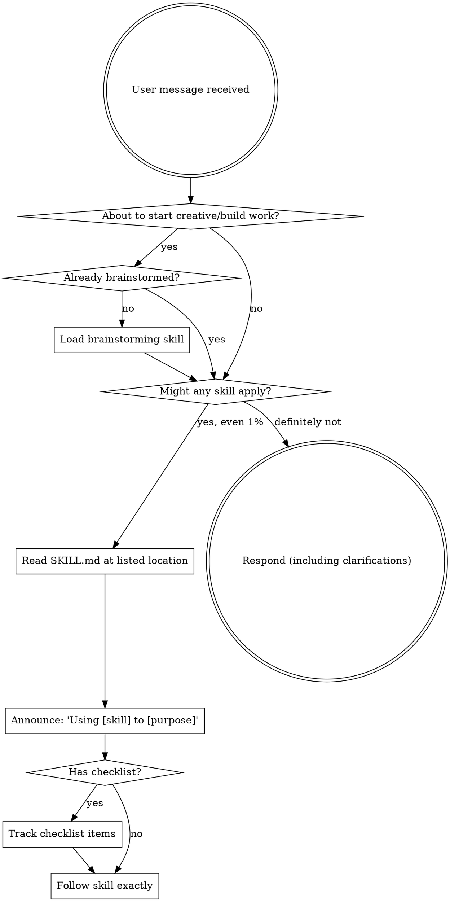

<EXTREMELY-IMPORTANT>
If there is even a 1% chance a skill might apply, you MUST load and read it before responding.
This is non-negotiable. You cannot rationalize your way out of this.
</EXTREMELY-IMPORTANT>

## How to Access Skills

**In Pi:** Skills are listed in `<available_skills>` in your context. When a skill applies,
use the `Read` tool to load the full `SKILL.md` at the listed location. Then follow its instructions.

# Using Skills

## The Rule

**Load relevant or requested skills BEFORE any response or action.** Even a 1% chance means load it.
If a loaded skill turns out to be wrong for the situation, you don't need to use it.

## Red Flags

These thoughts mean STOP — you're rationalizing:

| Thought | Reality |
|---------|---------|
| "This is just a simple question" | Questions are tasks. Check for skills. |
| "I need more context first" | Skill check comes BEFORE clarifying questions. |
| "Let me explore the codebase first" | Skills tell you HOW to explore. Check first. |
| "I can check git/files quickly" | Files lack conversation context. Check for skills. |
| "This doesn't need a formal skill" | If a skill exists, use it. |
| "I remember this skill" | Skills evolve. Read current version. |
| "This doesn't count as a task" | Action = task. Check for skills. |
| "The skill is overkill" | Simple things become complex. Use it. |
| "I'll just do this one thing first" | Check BEFORE doing anything. |
| "I know what that means" | Knowing the concept ≠ using the skill. Load it. |
| "User said Add X / Fix Y" | Instructions say WHAT, not HOW. Skill workflows still apply. |

## Skill Priority

When multiple skills could apply:

1. **Process skills first** (brainstorming, debugging) — determine HOW to approach the task
2. **Implementation skills second** — guide execution

"Let's build X" → brainstorming first. "Fix this bug" → systematic-debugging first.
