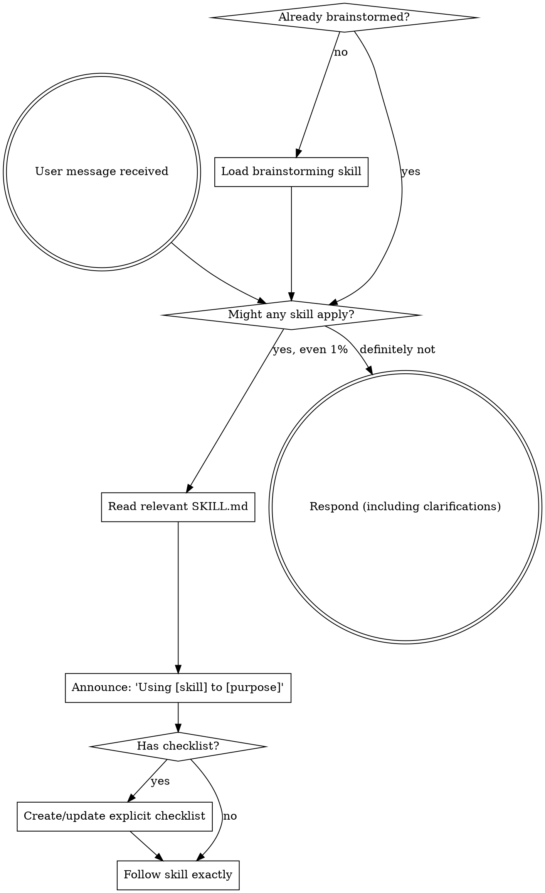

<EXTREMELY-IMPORTANT>
If there is even a 1% chance a skill applies, you MUST load and use it.

If a skill applies, you do not have discretion to skip it.
</EXTREMELY-IMPORTANT>

# Using Skills in Pi

## How to Access Skills

In Pi, load skills by reading their `SKILL.md` files from `~/.pi/agent/skills/` (or other configured skill directories).

If you are using the superpowers port, start from `superpowers/SKILL.md` and follow its compatibility mapping.

## The Rule

**Load relevant or requested skills BEFORE any response or action.**

Even if you only need to ask a clarifying question, check skills first.

## Red Flags

These thoughts mean STOP—you're rationalizing:

| Thought | Reality |
|---------|---------|
| "This is a simple question" | Questions are tasks. Check for skills. |
| "I need context first" | Skill check comes before clarifying questions. |
| "I can inspect files quickly first" | Skills define how to inspect. Check first. |
| "I remember the skill" | Skills change. Read current text. |
| "This is overkill" | Discipline prevents rework. Use the skill. |

## Skill Priority

When multiple skills may apply:

1. **Process skills first** (brainstorming, debugging)
2. **Implementation skills second** (domain-specific execution)

## User Instructions

User instructions say **what** to do. Skills define **how** to do it.
